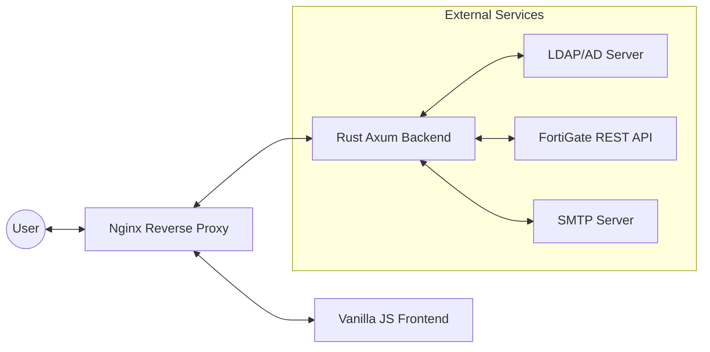

# 🏗️ System Architecture: Firewall Access Portal

This document provides a detailed technical explanation of the **Self-Service Firewall Access Request System**.

---

## 1. High-Level Overview

The system is a **Stateless API Orchestrator**. It does not maintain its own database; instead, it uses the **FortiGate Firewall** as the "Source of Truth" for all access states and the **LDAP Server** for identity management.

### Architecture Diagram

---

## 2. Component Breakdown

### A. Frontend (Presentation Layer)
- **Technology:** Vanilla HTML5, JavaScript (ES6+), Tailwind CSS (CDN).
- **Responsibility:** 
    - Collecting user input (Multiple IPs/Names, Document Name, Expiry).
    - Collecting additional CC email recipients.
    - Client-side validation (Regex for IPs and Emails).
    - Managing session state via JWT cookies.
- **Communication:** Communicates exclusively with the Nginx proxy via the `/api` prefix.

### B. Backend (Logic Layer)
- **Framework:** [Axum](https://github.com/tokio-rs/axum) (Rust) running on the [Tokio](https://tokio.rs/) runtime.
- **Core Modules:**
    - `auth.rs`: Handles LDAP binding and JWT generation.
    - `fortigate.rs`: The "Orchestrator" that translates business logic into FortiGate API calls, manages multi-recipient email notifications, and handles policy deletion.
    - `handlers.rs`: Manages HTTP request/response cycles, input validation, legacy field compatibility, and the automated cleanup endpoint.
    - `models.rs`: Defines data structures for firewall requests, including support for multiple IP entries and CC email lists.
    - `middleware.rs`: Intercepts every request to verify the JWT in the cookie.

### C. Infrastructure (Deployment Layer)
- **Docker Compose:** Orchestrates two containers: `backend` and `frontend`.
- **Nginx:** Functions as a **Reverse Proxy**. It serves static files for the frontend and routes all traffic starting with `/api/` to the Rust backend on port 5050.
- **Automated Cleanup (Cron):** An external cron job triggers the cleanup service via the API at regular intervals.

---

## 3. Data Flow: The Journey of a Request

When a user submits a request, the following sequence occurs:

1.  **Authentication Check:** The `auth_middleware` extracts the JWT from the `http-only` cookie. If valid, the request proceeds.
2.  **Validation:** The backend validates the IP addresses and expiry date using the `validator` crate.
3.  **FortiGate Orchestration (The "Triple Check"):**
    - **Step 1 (Address):** Checks if an address object for the IP exists. If not, it creates `ADDR_1.2.3.4`.
    - **Step 2 (Schedule):** Checks if a one-time schedule for the requested date exists (e.g., `20260401`). If not, it creates it.
    - **Step 3 (Policy):** It looks for a policy named `AUTO-T2S-Doc-[Date]` or `AUTO-E2S-Doc-[Date]`. 
        - If it exists, it **appends** the new IP to the `srcaddr` list.
        - If not, it creates a **new policy** and uses `move` to place it before **Rule ID 285** (ensuring it bypasses the "Block All" rule).
4.  **Notification:** Once the firewall confirms success, the backend sends a multi-recipient email via SMTP:
    - **Sender:** Uses the `SMTP_FROM` address.
    - **To Recipients:** Combines the requester's email (from the session) and the administrative list in `SMTP_TO`.
    - **CC Recipients:** Combines the global `SMTP_CC` list and any additional emails provided by the user in the "CC To" field.
    - **Cleaning:** The system automatically deduplicates all email addresses and ensures that recipients in the "To" list are not repeated in the "CC" list.

---

## 4. Automated Policy Cleanup

To prevent firewall policy bloat, the system includes a specialized cleanup service.

### API Endpoint: `GET /api/cleanup-expired`
This endpoint is designed to be called by an external cron job or monitoring system.

### Workflow:
1.  **Authentication:** Requires the `X-API-KEY` header matching the server's `CLEANUP_API_KEY`.
2.  **Discovery:** Fetches all firewall policies from the FortiGate API.
3.  **Filtering:** Only processes policies matching the strict naming convention: `^AUTO-(?:T2S|E2S)-Doc-(\d{8})$`.
4.  **Expiration Logic:** 
    - Extracts the `YYYYMMDD` date from the policy name.
    - Calculates the expiry date as `Policy Date + CLEANUP_GRACE_DAYS` (default 2 days).
    - If `Current Date > Expiry Date`, the policy is deleted via the FortiGate API.
5.  **Safety Guards:** 
    - Strict regex matching prevents accidental deletion of manually created policies.
    - Name length verification (exactly 21 characters).
    - `dry_run=true` query parameter for safe testing.

---

## 5. Security Implementation

### Identity & Session
- **LDAP Binding:** No passwords are saved. The app performs a "Simple Bind" against your LDAP/AD. If successful, it discards the password and issues a JWT.
- **JWT (JSON Web Token):** Encrypted with a `JWT_SECRET`. Contains user info (email, name) and an 8-hour expiration.
- **HTTP-Only Cookies:** The JWT is stored in a cookie that cannot be accessed by JavaScript (XSS Protection).

### API Security
- **Cleanup API Key:** The automated cleanup endpoint is protected by a dedicated `CLEANUP_API_KEY` to prevent unauthorized triggers.

### Network Security
- **Rate Limiting:** The `LoginRateLimiter` prevents brute-force attacks by limiting login attempts to 5 per 15 minutes per username.
- **CORS:** The backend only accepts requests from the `ALLOWED_ORIGIN` specified in the `.env` file.
- **TLS/SSL:** In production, Nginx Proxy Manager (NPM) terminates SSL, ensuring all traffic between the user and the server is encrypted.

---

## 6. Technical Decisions & Trade-offs

| Decision | Reason |
| :--- | :--- |
| **Rust (Axum)** | Chosen for extreme memory safety and performance. As a security tool, using a language that prevents memory leaks and crashes is critical. |
| **Statelessness** | By not having a database, the app is highly portable and never goes "out of sync" with the firewall. If a rule is deleted manually on the firewall, the app detects it on the next run. |
| **Nginx Proxy** | Decoupling the frontend from the backend allows for easy scaling and simplifies the handling of static assets and API routing. |
| **Rule ID 285** | Hardcoding the insertion point ensures that automated rules never interfere with critical system-wide "Top" rules or get "shadowed" by "Bottom" block rules. |
| **"AUTO-" Prefix** | Explicitly marking automated policies ensures the cleanup service never touches production-critical or manually managed firewall rules. |

---

## 7. Environment Configuration

The architecture is controlled by the `.env` file and `docker-compose.yml`:
- `FORTIGATE_BASE_URL`: API Endpoint for the firewall.
- `COOKIE_SECURE`: Toggle for HTTP vs HTTPS environments.
- `PORT`: The internal binding port (5050).
- `JWT_SECRET`: The key used to sign session tokens.
- `CLEANUP_API_KEY`: The secure key required to trigger automated cleanup.
- `CLEANUP_GRACE_DAYS`: Number of days to keep policies after their requested date (default: 2).
- `SMTP_FROM`: The official sender email address.
- `SMTP_TO`: Global administrative recipients (comma-separated).
- `SMTP_CC`: Global CC recipients for all notifications (comma-separated).
